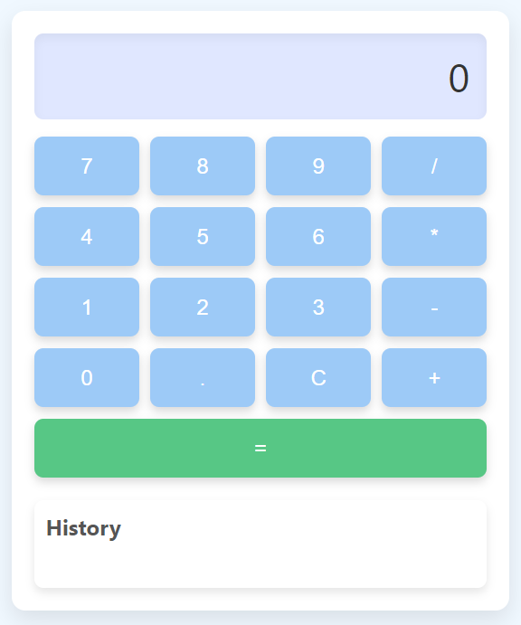

# Basic Calculator

A simple yet functional calculator that can perform arithmetic operations following the BODMAS rule. Built using HTML, CSS, and JavaScript.

## Features
- User-friendly interface with buttons for digits, operators, and functions.
- Supports addition, subtraction, multiplication, and division.
- Follows the BODMAS order of operations.
- Displays calculation history.

## Technologies
- **HTML**
- **CSS**
- **JavaScript**

## How to Use
- Click on the number buttons to enter values.
- Click on the operators (+, -, *, /) to perform calculations.
- Click on "=" to get the result.
- Use the "C" button to clear the display.
- View your calculation history in the section below the calculator.

## Screenshot

